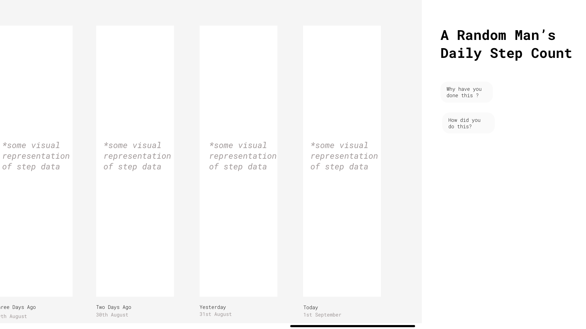

# Fitbit API Experiment 🏃 

## Start of the project

* Started by registering an App on https://dev.fitbit.com/
* Then used the OAuth 2.0 process
* Authorized access to data of my own Fitbit Device
* After getting an access token we can now make GET requests to Fitbit's web API
* This site https://dev.fitbit.com/build/reference/web-api/explore/ outlines possible requests to the Fitbit Web API

## Current Challenges: ✏️ 
* Access Tokens only last 8 hours before needing to be refreshed, can this be done programatically with Javascript inside our React app?
* What data do we wish to use from the API? How can we interpret, visualise or utilise the data?

## Accesible Data and Possible Uses:

#### So far through the API I can access the model of my Fitbit and current battery level, thrilling!

#### Slightly more interestingly I can access my activity levels on an a specific date, it could be helpful to visualise my daily step count in an creative way.
 

## Current Project Ideas and Purpose 

* Single page app the shows current day on load with lastest step count + three days previous
* Number of steps rendered as Jelly Beans or something interesting
* Experimenting with methods of visualising data
* Optimise for Desktop and Mobile

## Early Wirefames w/ Adobe xd
### Initial Desktop and Mobile Layout

### Desktop Design Iteration

